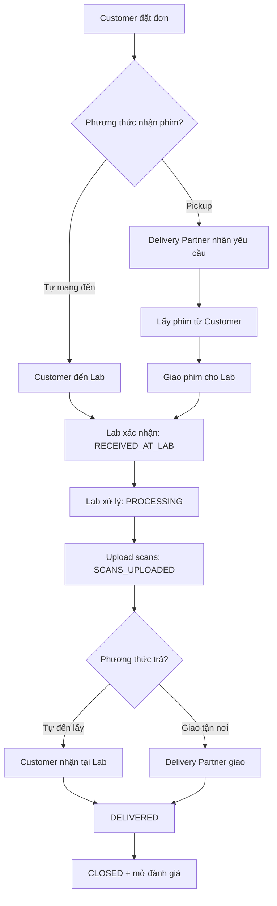

```mermaid
flowchart TD
    A[Customer đặt đơn] --> B{Phương thức nhận phim?}
    B -->|Tự mang đến| C[Customer đến Lab]
    B -->|Pickup| D[Delivery Partner nhận yêu cầu]
    D --> E[Lấy phim từ Customer]
    E --> F[Giao phim cho Lab]
    C --> G[Lab xác nhận: RECEIVED_AT_LAB]
    F --> G
    G --> H[Lab xử lý: PROCESSING]
    H --> I[Upload scans: SCANS_UPLOADED]
    I --> J{Phương thức trả?}
    J -->|Tự đến lấy| K[Customer nhận tại Lab]
    J -->|Giao tận nơi| L[Delivery Partner giao]
    K --> M[DELIVERED]
    L --> M
    M --> N[CLOSED + mở đánh giá]
```
